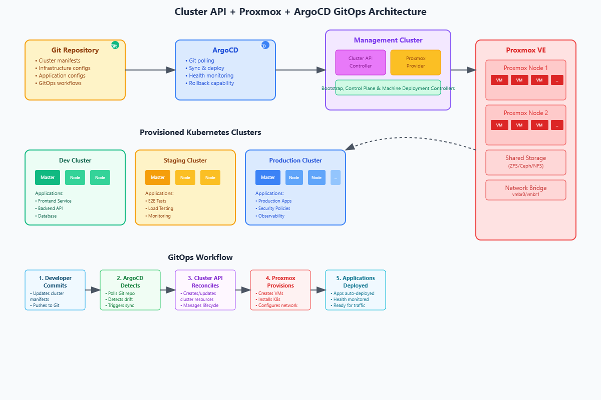

# atlas
GitOps configuration with Cluster-API to provision k8s clusters on Proxmox



## Requirements
- KinD as management cluster
- Proxmox Server 
- Cluster-API
- ArgoCD for GitOps workflow

## Roadmap
- Create a management cluster for Cluster-API
- Create a Kubernetes VM Template
- Initialize Cluster-API and configure GitOps like workflow
- Create first workload cluster

### Create Management cluster
```shell
cd kind
kind create cluster --name management-cluster --config kind-config.yaml
```

### Create kubernetes VM template
- Create API access to Proxmox, on the proxmox node run:
```shell
pveum user add caprox@pve
pveum aclmod / -user caprox@pve -role PVEAdmin
pveum user token add caprox@pve capi -privsep 0
```
```shell
root@server1:~# pveum user token add caprox@pve capi -privsep 0
┌──────────────┬──────────────────────────────────────┐
│ key          │ value                                │
╞══════════════╪══════════════════════════════════════╡
│ full-tokenid │ caprox@pve!capi                      │
├──────────────┼──────────────────────────────────────┤
│ info         │ {"privsep":"0"}                      │
├──────────────┼──────────────────────────────────────┤
│ value        │ 6e59df15-a2c9-4dc5-b293-367772950c68 │
└──────────────┴──────────────────────────────────────┘
```
- Start Build-Job for VM template
```shell
# create a namespace for the build
kubectl create namespace proxmox-build-infrastructure-system
# apply secret & job
kubectl apply -f image-builder/secret.yaml
kubectl apply -f image-builder/job.yaml
# start the build
kubectl create job build-image --from cj/proxmox-template-builder -n proxmox-build-infrastructure-system 
```
- Monitor current state of the build-pod
```shell
kubectl get pods -n proxmox-build-infrastructure-system
NAME                READY   STATUS    RESTARTS   AGE
build-image-tdv78   1/1     Running   0          97s
kubectl logs -f -n proxmox-build-infrastructure-system build-image-tdv78
```
Wait until the job is done and a VM template will show up on the Proxmox UI. Kubernetes will automatically restart the job if the build fails.

### Initialize Cluster-API
- Install ArgoCD
```shell
kubectl create namespace argocd
kubectl apply -n argocd -f https://raw.githubusercontent.com/argoproj/argo-cd/stable/manifests/install.yaml
```
- Install Cluster-API components as ArgoCD applications.
We are going to apply them one by one in order and checked for each one it's Healthy and Synced as they are dependible.
```shell
kubectl apply -f apps/app-cert-manager.yaml
```
```shell
kubectl apply -f apps/app-cluster-api.yaml
```
```shell
kubectl apply -f apps/app-caprox-engine.yaml
```
```shell
kubectl get apps -A
```
```shell
NAME                                 SYNC STATUS   HEALTH STATUS
cluster-api-operator-caprox-engine   Synced        Healthy
cluster-api-operator-cert-manager    Synced        Healthy
cluster-api-operator-main            Synced        Healthy
```
- Connect to Proxmox API
```shell
kubectl apply -f apps/secret-caprox.yaml
```
We need to trigger a restart of the proxmox-provider to read the new secret
```shell
kubectl rollout restart deploy capmox-controller-manager -n proxmox-infrastructure-system
```
- Configure IP Range for the Cluster-API
```shell
kubectl apply -f apps/ip-pool.yaml
```
### Create first workload cluster
- by applying cluster yaml we will have our first workload cluster provisioned. But since we are going to use GitOps approach, we are going to apply an argocd application to sync with a specefic folder in the repo.

```shell
kubectl apply -f apps/app-workload-cluster.yaml
```
- Retrieve Kubeconfig
```shell
kubectl get secrets -n caprox-kubernetes-engine manuels-k8s-cluster-kubeconfig -o jsonpath='{.data.value}' | base64 --decode > kubeconfig.yaml

# Connect to the new cluster
export KUBECONFIG=./kubeconfig.yaml
```
```shell
kubectl get nodes

NAME                                            STATUS   ROLES           AGE     VERSION
atlas-k8s-cluster-control-plane-4z458-ghx2z     Ready    control-plane   11m     v1.33.1
atlas-k8s-cluster-worker-6vhjx-c2nv2-v4dbw      Ready    node            5m23s   v1.33.1
```

### Scale your workload cluster
Scale up or down is done easily by changing the `replicas` filed in `manifests/cluster.yaml` file and commit your changes. 
```shell
git commit -m "scale workers to 3"
```
The changes will be applied after argocd reconcile.
